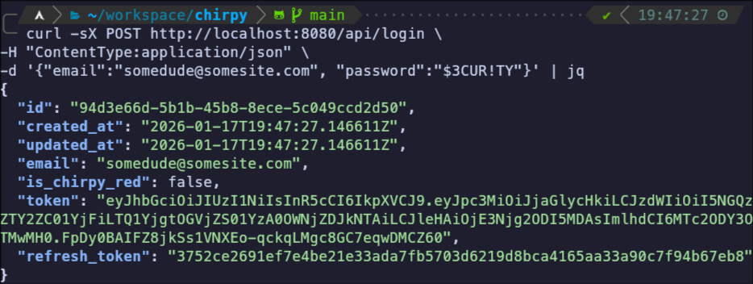
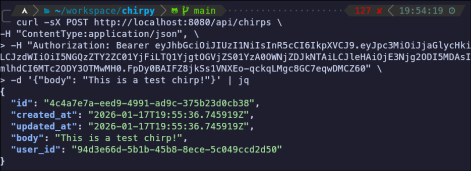
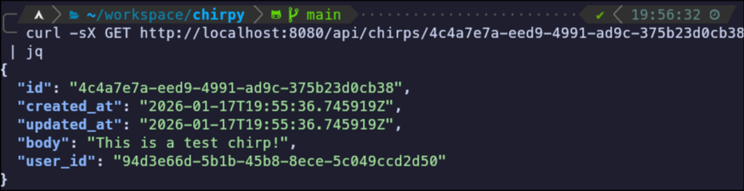

# Chirpy

## 🐦 Twitter but ripped-off

**Chirpy** is a small _webserver_ which implements some basic (and cool) real world
applicable features such as:

1. Authorisation via JWTs
2. Refreshing the JWTs with a longer lasting access token
3. Basic updating account information
4. A _paid_ subscription (let's be honest, that's very _real world_)

---

## A small walkthrough

First ensure that the program is running, you can do it by simply running `go run .` while inside the directory.
Then open a new terminal window to get started with the requests

For this I'm using `curl` for http requests & `jq` for parsing JSON, however that
obviously isn't necessary and you _could_ use any other alternative

### 1) Making a User

```
curl -sX POST http://localhost:8080/api/users \
-H "ContentType:application/json" \
-d '{"email":"somedude@somesite.com", "password":"$3CUR!TY"}' | jq
```

The create user endpoint can be found by sending a `POST` request to `/api/users`. 
Send some JSON data there in the format `{"email":EMAIL, "password":PASSWORD}`

### 2) Login

```
curl -sX POST http://localhost:8080/api/login \
-H "ContentType:application/json" \
-d '{"email":"somedude@somesite.com", "password":"$3CUR!TY"}' | jq
```

Next up we would like to login to the account that we just made in order to get our login keys.
In the real world, these are what allow you to be auto-logged into an account without having to enter
your email and password _every_ time.

You should get something like this:


The JWT token (simply dubbed `token`) is the important one. The `refresh_token` is used to get more JWT tokens.

> [!TIP]
> If you need another JWT token and don't want to login again, send a POST request to `/api/refresh` with 
> an `Authorization` header like the one you'll see in step three

### 3) Creating a Chirp

```
curl -sX POST http://localhost:8080/api/chirps \
-H "ContentType:application/json", \                   
-H "Authorization: Bearer INSERT_TOKEN \
-d '{"body": "This is a test chirp!"}' | jq
```

A chirp is message that goes on the SQL database. You must add your JWT token in an `Authorization` header and
have a JSON object sent with a `body` property which is simply the text in the chirp.

You'll get an output like this:


### 4) Read Chirp

```
curl -sX GET http://localhost:8080/api/chirps/CHIRP_ID | jq
```

Don't throw away the output of the create chirp endpoint, we need it for this step! This allows you to view a chirp, **note that** there is
no `Authorization` header here meaning that anyone can view any chirp (as expected)

---

You might see something like this:


## To-do List
- [ ] Give more examples like deleting chirps, updating accounts etc.
- [ ] Give info on `fileServerHits`
- [ ] Make a nice big table
